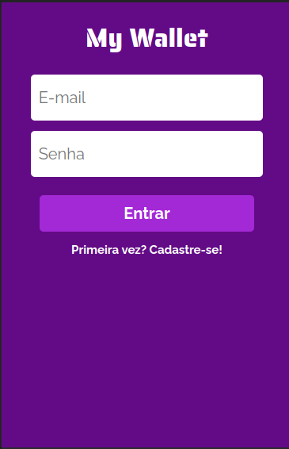
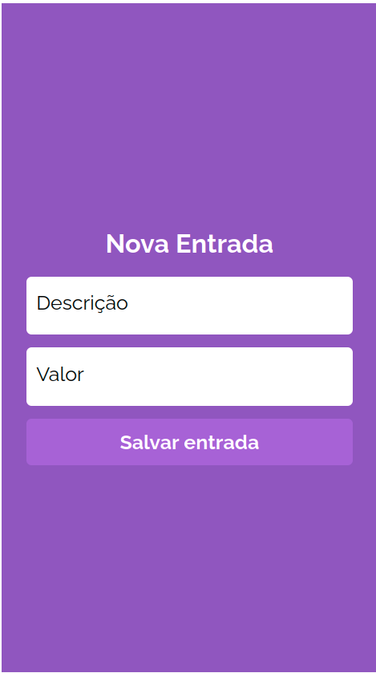
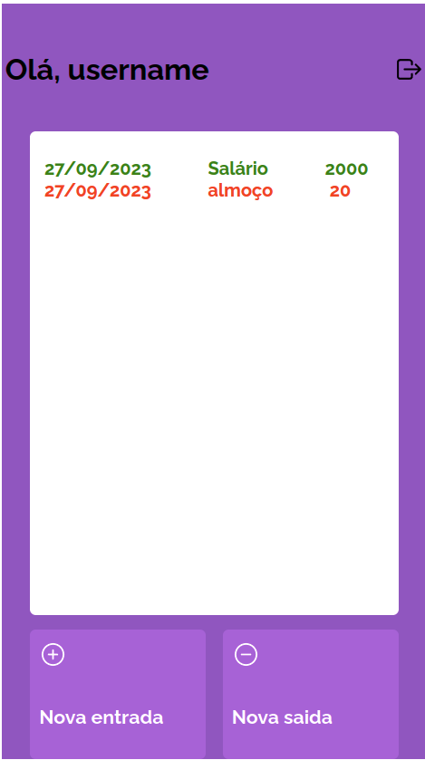

<style>
.auth {
   display: flex;
   gap: 8px;
   align-items: center;
   justify-content: center;
}

.auth img {
   width: 300px;
}
</style>


# My Wallet - Client

<p> Projeto de planejamento e controle de custos, o usuário pode criar uma conta, logar e inserir dados de transações de entrada e saída de saldo, contabilizando o saldo atual total.</p>

## Instruções de Instalação e execução
Digite a seguinte sequência de comandos no terminal:

<h5>Sem chave ssh</h5>

```
git clone https://github.com/igor-gui/projeto14-mywallet-front.git
cd projeto14-my-wallet-front
npm i
npm start
```
<h5>Com chave ssh</h5>

```
git clone git@github.com:igor-gui/projeto14-mywallet-front.git
cd projeto14-my-wallet-front
npm i
npm start
```

Caso o navegador não abra automaticamente, clique no terminal e aperte a tecla "o".


## Tecnologias Utilizadas (Used Techonologies)

```
Styled-Components, Typescript, React, Vite, Axios, React-Router-Dom, eslint
```
### Telas de Autenticação
<div class='auth'>


</div>

### Home Page e Tela de Adição de transação:

<div class='auth'>


</div>